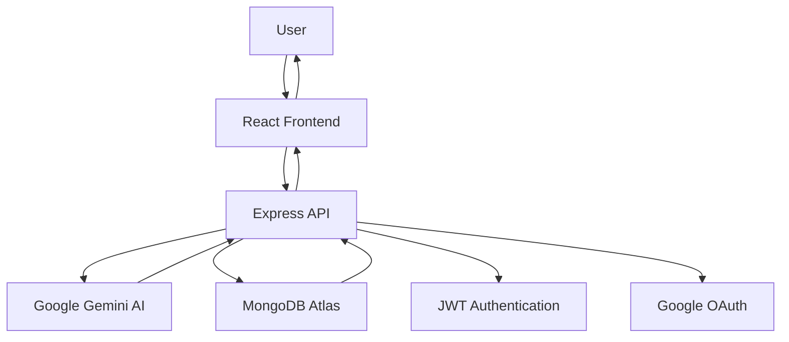
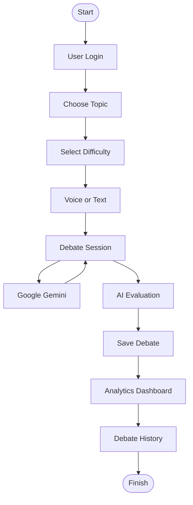
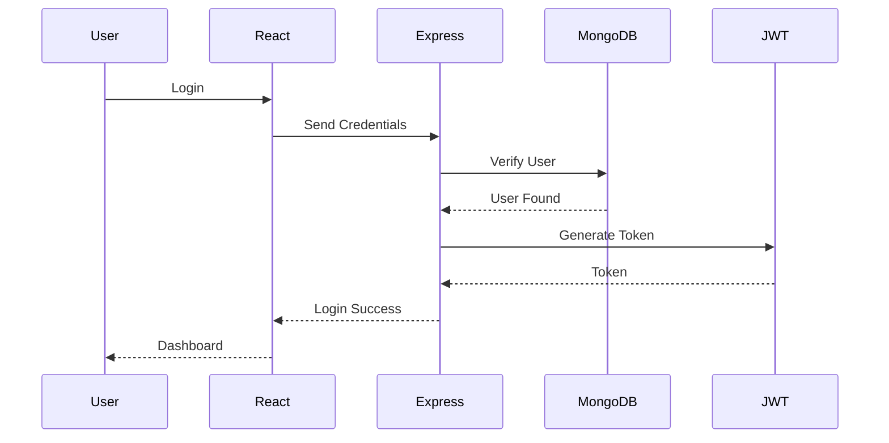
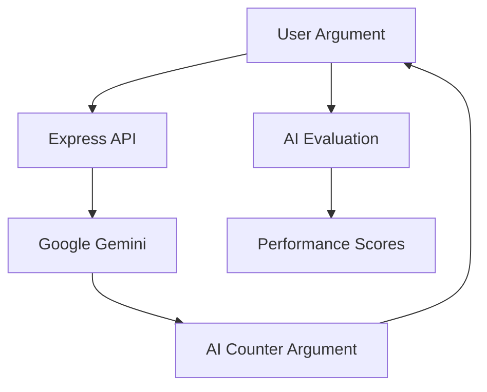

<div align="center">

# ⚔️ AI Debate Arena

### **An Intelligent AI-Powered Debate & Rhetorical Analytics Platform**

Practice structured debates against an adaptive AI opponent, receive real-time feedback, improve logical reasoning, strengthen public speaking skills, and track your progress with comprehensive analytics.

---

[](https://react.dev/)
[](https://nodejs.org/)
[](https://expressjs.com/)
[](https://www.mongodb.com/atlas)
[](https://ai.google.dev/)
[](https://jwt.io/)
[](https://developers.google.com/identity)
[](https://render.com/)
[](#license)

<br>

🚀 **Live Demo:** https://ai-debate-backend-o9rt.onrender.com/

📂 **Repository:** https://github.com/Peethambari123/AI-Debate-Arena2

⭐ Star this repository if you found it useful!

</div>

---

# 📖 Table of Contents

- Overview
- Why AI Debate Arena?
- Problem Statement
- Objectives
- Benefits
- Key Features
- Screenshots
- Technology Stack
- System Architecture
- Workflow
- Project Structure
- Authentication Flow
- AI Debate Flow
- AI Evaluation
- Analytics Dashboard
- Debate History
- Installation
- Environment Variables
- Deployment
- API Documentation
- Security
- Challenges
- Future Enhancements
- Contributing
- License
- Developer

---

# 🌍 Overview

**AI Debate Arena** is a full-stack AI-powered web application that enables users to engage in structured debates against an intelligent virtual opponent.

Instead of chatting with a generic chatbot, users participate in formal debates where the AI actively challenges arguments, provides counterpoints, evaluates reasoning, and delivers detailed performance analytics after every session.

The platform supports both **text-based** and **voice-based** debates, making it suitable for students, competitive debaters, public speakers, interview preparation, and anyone interested in improving critical thinking and communication skills.

Using **Google Gemini AI**, the system generates context-aware rebuttals, evaluates debate quality, and provides constructive feedback to help users continuously improve.

---

# 💡 Why AI Debate Arena?

Traditional debate practice often requires experienced partners, judges, or mentors. This makes regular practice difficult for many learners.

AI Debate Arena removes these barriers by offering an AI opponent that is always available, adapts to different difficulty levels, and provides objective feedback after every debate.

Whether you're preparing for competitions, improving public speaking skills, or simply strengthening logical reasoning, AI Debate Arena offers an interactive environment for continuous learning.

---

# ❗ Problem Statement

Developing strong debating skills requires consistent practice and high-quality feedback.

However, existing solutions often have several limitations:

- Finding debate partners can be difficult.
- Human evaluations may introduce subjectivity.
- Most AI chat applications focus on conversation rather than structured debate.
- Users rarely receive detailed performance analysis.
- Progress tracking across multiple debates is often unavailable.
- Voice-based debating support is limited in many platforms.

AI Debate Arena addresses these challenges by providing a structured, AI-assisted debate environment with real-time evaluation and analytics.

---

# 🎯 Objectives

The primary objectives of AI Debate Arena are:

- Provide an intelligent AI debate partner available anytime.
- Improve users' logical reasoning and persuasion skills.
- Encourage structured argument formation.
- Deliver detailed performance analysis after every debate.
- Support both voice and text interaction.
- Maintain debate history for long-term progress tracking.
- Provide a secure authentication system for user accounts.
- Create an engaging learning experience using Artificial Intelligence.

---

# ✨ Benefits

### 🎤 Improve Public Speaking

Practice speaking confidently through interactive AI debates.

---

### 🧠 Strengthen Critical Thinking

Develop logical reasoning by defending arguments against intelligent counterpoints.

---

### 📈 Track Continuous Progress

Monitor debate performance through historical analytics and score trends.

---

### 🤖 Learn with AI

Receive instant, objective feedback powered by Google Gemini AI.

---

### 🌎 Practice Anytime

No need for debate partners or judges—practice whenever you want.

---

### 📚 Educational Value

Suitable for students, competitive debaters, educators, and interview preparation.

---

# ✨ Key Features

## 🔐 Secure Authentication

- User Registration
- Login System
- JWT Authentication
- Google OAuth Login
- Password Reset
- Protected Routes
- Profile Management

---

## 🤖 AI Debate Engine

- AI-powered debate opponent
- Real-time counter arguments
- Multiple debate difficulty levels
- Custom debate topics
- Topic selection
- Timed debate sessions
- Adaptive AI responses

---

## 🎤 Voice & Text Debate

- Voice Recognition
- Speech-to-Text
- Text-to-Speech
- Traditional text debates
- Live interaction
- Automatic speech playback

---

## 📊 AI Performance Evaluation

After every debate, the system evaluates:

- Topic Relevance
- Argument Quality
- Evidence Usage
- Counter Arguments
- Logical Consistency
- Communication Style

Each category receives an individual score along with detailed suggestions for improvement.

---

## 📈 Analytics Dashboard

Visual statistics include:

- Total Debates
- Wins & Losses
- Average Score
- Highest Score
- Score Progress
- Topic Distribution
- Performance Trends

---

## 📜 Debate History

- View previous debates
- Replay conversations
- Compare performances
- Review AI feedback
- Delete old debates
- Track long-term improvement

---

## 🎨 Modern User Interface

- Responsive Design
- Dark Theme
- Smooth Animations
- Interactive Components
- Clean Navigation
- Mobile Friendly
- Professional Dashboard

---
# 📸 Screenshots

> **Note:** Replace the placeholder images below with actual screenshots from your application.

---

## 🏠 Landing Page

<p align="center">

</p>

A modern landing page introducing AI Debate Arena with feature highlights, authentication options, and project overview.

---

## 🔑 Login & Registration

<p align="center">

</p>

Supports:

- JWT Authentication
- Google OAuth Login
- Secure Password Management
- User Registration

---

## ⚔️ Debate Arena

<p align="center">

</p>

Users can:

- Select debate topic
- Choose side (For / Against)
- Choose difficulty
- Select duration
- Debate using Text or Voice
- Receive AI counter arguments in real time

---

## 📊 Analytics Dashboard

<p align="center">

</p>

Visualizes:

- Win Rate
- Average Score
- Debate Statistics
- Score Trends
- Topic Distribution
- Performance History

---

## 📜 Debate History

<p align="center">

</p>

Users can review previous debates along with AI evaluations and performance scores.

---

# 🛠 Technology Stack

## Frontend

| Technology | Purpose |
|------------|---------|
| React.js | User Interface |
| Tailwind CSS | Styling |
| Framer Motion | Animations |
| React Router | Routing |
| Lucide React | Icons |
| Recharts | Charts |
| Web Speech API | Speech Recognition |
| SpeechSynthesis API | Text-to-Speech |

---

## Backend

| Technology | Purpose |
|------------|---------|
| Node.js | Runtime Environment |
| Express.js | REST API |
| MongoDB Atlas | Database |
| Mongoose | ODM |
| JWT | Authentication |
| Passport.js | Google OAuth |
| bcrypt | Password Hashing |
| dotenv | Environment Variables |
| CORS | Cross-Origin Requests |

---

## AI

| Technology | Purpose |
|------------|---------|
| Google Gemini | AI Debate Generation |
| Prompt Engineering | AI Behaviour |
| JSON Response Parsing | Evaluation |
| Speech Processing | Voice Debate |

---

## Deployment

| Platform | Purpose |
|----------|---------|
| Render | Hosting |
| MongoDB Atlas | Cloud Database |
| Google AI Studio | Gemini API |

---

# 🏗 System Architecture



---

# 🔄 Application Workflow



---

# 📂 Project Structure

```text
AI-Debate-Arena/

│

├── public/

│ ├── favicon.ico

│ ├── index.html

│ └── manifest.json

│

├── src/

│ ├── components/

│ ├── pages/

│ ├── utils/

│ ├── services/

│ ├── assets/

│ ├── App.js

│ └── index.js

│

├── server.js

├── package.json

├── README.md

├── .env.example

└── .gitignore
```

---

# 🔐 Authentication Flow



---

# 🤖 AI Debate Flow



---

# ⚖ AI Evaluation Criteria

The AI evaluates every completed debate using multiple performance parameters.

| Evaluation Metric | Description |
|-------------------|-------------|
| Topic Relevance | Focus on debate topic |
| Argument Quality | Logical reasoning |
| Evidence | Supporting facts |
| Counter Arguments | Rebuttal strength |
| Logical Consistency | Detect contradictions |
| Communication | Overall presentation |

---

## 📊 Evaluation Process

1. User completes debate.

2. Debate transcript is sent to Gemini.

3. AI analyses the conversation.

4. Individual category scores are generated.

5. Overall score is calculated.

6. Winner is decided.

7. Feedback is generated.

8. Debate is saved.

9. Dashboard statistics are updated.

10. User can review the debate anytime.

---

# 📊 Analytics Dashboard

The Analytics Dashboard provides users with comprehensive insights into their debate performance. Every completed debate contributes to the overall statistics, helping users measure improvement over time.

---

## Dashboard Overview

The dashboard displays:

- 📈 Total Debates
- 🏆 Wins & Losses
- 📊 Win Rate
- ⭐ Average Score
- 🥇 Highest Score
- 📅 Recent Activity
- 📚 Topic Distribution
- 📈 Score Progression

---

## Performance Metrics

| Metric | Description |
|---------|-------------|
| Total Debates | Number of completed debates |
| Total Wins | Total debates won |
| Total Losses | Total debates lost |
| Win Percentage | Overall success rate |
| Average Score | Mean debate score |
| Highest Score | Best recorded performance |
| Average Debate Duration | Time spent debating |
| Most Debated Topic | Frequently selected topic |

---

## Performance Charts

The application visualizes user performance using interactive charts.

### Supported Charts

- Score Progress Chart
- Win/Loss Distribution
- Topic Distribution
- Category-wise Performance
- Average Score Trend
- Debate Activity Timeline

---

# 📜 Debate History

Every debate is securely stored for future review.

Users can:

- View previous debates
- Read complete debate transcripts
- Review AI evaluations
- Compare previous performances
- Track score improvements
- Delete unwanted history

---

## Stored Information

Each debate stores:

- Debate Topic
- User Side
- Difficulty Level
- Debate Duration
- Complete Transcript
- AI Responses
- Category Scores
- Final Result
- Date & Time

---

# ⚙ Installation Guide

## Prerequisites

Before running the project, install:

- Node.js (v18 or later)
- npm
- MongoDB Atlas Account
- Google Gemini API Key
- Google OAuth Credentials
- Git

---

## Clone Repository

```bash
git clone https://github.com/Peethambari123/AI-Debate-Arena2.git

cd AI-Debate-Arena2
```

---

## Install Dependencies

```bash
npm install
```

---

## Configure Environment Variables

Create a `.env` file in the project root.

```bash
cp .env.example .env
```

---

## Start Development Server

```bash
npm start
```

The application will be available at

```
http://localhost:3000
```

---

# 🔐 Environment Variables

Example configuration:

```env

PORT=3000

MONGO_URI=your_mongodb_connection_string

JWT_SECRET=your_jwt_secret

SESSION_SECRET=your_session_secret

GOOGLE_CLIENT_ID=your_google_client_id

GOOGLE_CLIENT_SECRET=your_google_client_secret

GEMINI_API_KEY=your_gemini_api_key

CLIENT_URL=http://localhost:3000

REACT_APP_API_URL=http://localhost:3000

```

---

# 🚀 Deployment

The application can be deployed using **Render**.

## Deployment Steps

### 1. Push Code

Push the latest code to GitHub.

---

### 2. Create Render Web Service

Connect the GitHub repository to Render.

---

### 3. Configure Build

Build Command

```bash
npm install
```

Start Command

```bash
node server.js
```

---

### 4. Add Environment Variables

Configure all variables from the `.env` file inside Render.

---

### 5. Deploy

Render automatically builds and deploys the application.

---

# 🌐 API Documentation

## Authentication APIs

| Method | Endpoint | Description |
|---------|----------|-------------|
| POST | /auth/register | Register user |
| POST | /auth/login | Login |
| GET | /auth/google | Google Login |
| GET | /auth/me | Current User |
| PUT | /auth/profile | Update Profile |
| PUT | /auth/password | Change Password |
| POST | /auth/logout | Logout |

---

## Debate APIs

| Method | Endpoint | Description |
|---------|----------|-------------|
| POST | /api/gemini | Generate AI Response |
| POST | /debates/save | Save Debate |
| GET | /debates/history | Debate History |
| GET | /debates/analytics | Analytics |
| DELETE | /debates/:id | Delete Debate |

---

# 🔒 Security Features

The project follows several security practices.

## Authentication

- JWT Authentication
- Google OAuth
- Protected Routes
- Session Validation

---

## Password Security

- Password Hashing
- Secure Authentication
- Password Reset Support

---

## API Security

- Input Validation
- Authentication Middleware
- Environment Variables
- CORS Configuration

---

## Database Security

- MongoDB Atlas
- Secure Connection
- User Isolation
- Protected Collections

---

# ⚡ Performance Optimizations

- Optimized React Rendering
- Lazy Component Loading
- Efficient State Management
- API Response Optimization
- Fast Database Queries
- Responsive UI
- Optimized Bundle Size
- Efficient AI Request Handling

---

# ❓ Frequently Asked Questions (FAQ)

## 1. What is AI Debate Arena?

AI Debate Arena is an AI-powered debate platform that allows users to practice debates against an intelligent virtual opponent while receiving detailed performance evaluations and analytics.

---

## 2. Which AI model is used?

The application integrates **Google Gemini** to generate intelligent counterarguments, evaluate debates, and provide constructive feedback.

---

## 3. Can I debate using my voice?

Yes.

The platform supports both:

- 🎤 Voice Debate
- 💬 Text Debate

using browser speech technologies.

---

## 4. Is authentication secure?

Yes.

The application uses:

- JWT Authentication
- Google OAuth 2.0
- Password Hashing
- Protected Routes

to help secure user accounts.

---

## 5. Is my debate history saved?

Yes.

Completed debates are stored so users can revisit previous sessions, review evaluations, and monitor progress over time.

---

## 6. Can I choose my own debate topics?

Yes.

Users can select predefined topics or enter custom debate topics before starting a session.

---

## 7. Is the application mobile friendly?

Yes.

The interface is responsive and works across desktops, tablets, and modern mobile browsers.

---

# 🛠 Troubleshooting

## Application won't start

### Possible Causes

- Missing dependencies
- Incorrect Node version
- Missing environment variables

### Solution

```bash
npm install
npm start
```

---

## MongoDB Connection Failed

### Possible Causes

- Invalid MongoDB URI
- Network restrictions
- Incorrect credentials

### Solution

- Verify the MongoDB Atlas connection string.
- Check network access settings.
- Confirm database credentials.

---

## Google Login Not Working

### Solution

- Verify Google OAuth Client ID.
- Verify Client Secret.
- Check Redirect URI configuration.

---

## Gemini API Errors

### Solution

- Verify API Key.
- Check usage limits.
- Confirm API access is enabled.

---

## Speech Recognition Not Working

Speech recognition support depends on browser capabilities.

For the best experience, use the latest version of Google Chrome or another Chromium-based browser.

---

# 🌐 Browser Compatibility

| Browser | Supported |
|----------|-----------|
| Google Chrome | ✅ |
| Microsoft Edge | ✅ |
| Brave | ✅ |
| Opera | ✅ |
| Firefox | ⚠ Partial Voice Support |
| Safari | ⚠ Partial Voice Support |

---

# 🚧 Challenges Faced

During development several technical challenges were encountered, including:

- AI response formatting consistency
- Authentication integration
- Voice recognition compatibility
- Database schema management
- API communication
- Cross-Origin Resource Sharing (CORS)
- Environment configuration
- Deployment on Render
- Real-time debate evaluation
- Performance optimization

Each challenge contributed to improving the application's overall architecture and reliability.

---

# 💡 Key Learnings

This project provided valuable experience in:

- Full Stack MERN Development
- React Application Development
- REST API Design
- Authentication Systems
- MongoDB Integration
- Google Gemini API Integration
- Prompt Engineering
- AI Response Handling
- Voice Technologies
- Deployment & DevOps
- UI/UX Design
- Project Architecture

---

# 🔮 Future Enhancements

The project can be extended with additional capabilities such as:

- Multiplayer Human vs Human debates
- AI Judge Panel
- Debate Leaderboards
- Team Debate Mode
- Debate Tournament System
- PDF Performance Reports
- Video Debate Support
- Multi-language Debates
- AI Debate Coach
- Personalized Learning Paths
- Mobile Application
- Dark & Light Themes
- Admin Dashboard
- Community Discussion Forum

---

# 🤝 Contributing

Contributions are welcome.

If you would like to contribute:

1. Fork the repository

2. Create a feature branch

```bash
git checkout -b feature/YourFeature
```

3. Commit your changes

```bash
git commit -m "Added New Feature"
```

4. Push to GitHub

```bash
git push origin feature/YourFeature
```

5. Open a Pull Request

Please ensure that your code follows project standards and includes appropriate documentation where necessary.

---

# 📄 License

This project is distributed for educational and learning purposes.

Please refer to the repository for licensing details before using the project in production or commercial environments.

---

# 🙏 Acknowledgements

Special thanks to the technologies and communities that made this project possible.

- Google Gemini
- React
- Node.js
- Express.js
- MongoDB Atlas
- Tailwind CSS
- Render
- Passport.js
- JWT
- Framer Motion
- Recharts
- Lucide React
- Open Source Community

---

# 👨‍💻 Developer

<div align="center">

## **Peethambari Manavarti**

**AI & Full Stack Developer**

Passionate about Artificial Intelligence, Full Stack Development, Machine Learning, and building impactful software solutions.

### Connect with Me

💻 GitHub:
https://github.com/Peethambari123

🌐 Project Repository:
https://github.com/Peethambari123/AI-Debate-Arena2

🚀 Live Demo:
https://ai-debate-backend-o9rt.onrender.com/

</div>

---

# ⭐ Support

If you found this project useful,

⭐ Star the repository

🍴 Fork it

📝 Share feedback

🐞 Report issues

✨ Suggest improvements

Your support motivates future development.

---

<div align="center">

# ⚔️ AI Debate Arena

### Empowering Better Thinkers Through AI-Powered Debates

Built with ❤️ using

**React • Node.js • Express • MongoDB Atlas • Google Gemini AI**

⭐ **If you like this project, don't forget to star the repository!**

</div>
