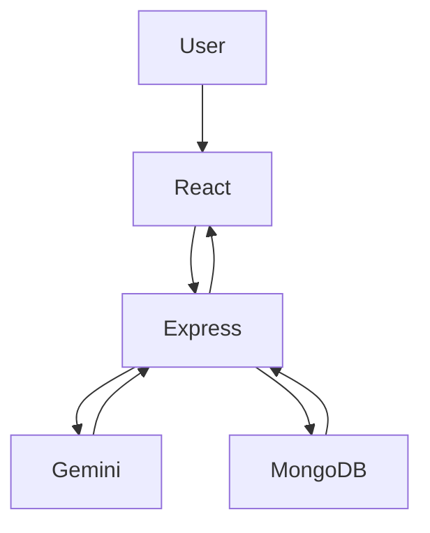
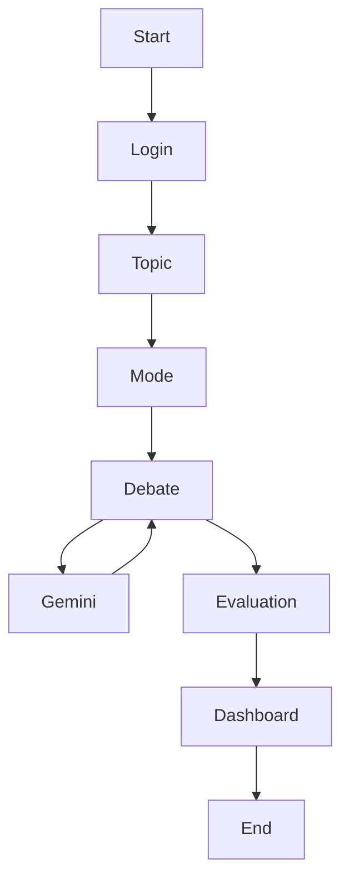

# 📖 Table of Contents

- Overview
- Problem Statement
- Features
- Tech Stack
- Screenshots
- System Architecture
- Workflow
- Project Structure
- Installation
- Environment Variables
- API Endpoints
- Deployment
- Future Enhancements
- Developer
- License

---

# 🌍 Overview

**AI Debate Arena** is a full-stack AI-powered debate platform that enables users to engage in structured debates against an intelligent AI opponent. The application helps users improve critical thinking, logical reasoning, public speaking, and argumentation skills through real-time AI-generated counterarguments and detailed post-debate evaluations.

Built using the MERN stack and Google Gemini AI, the platform supports both text and voice-based debates while providing analytics to monitor user performance over time.

---

# ❗ Problem Statement

Developing strong debating and communication skills requires consistent practice and meaningful feedback. Traditional debate practice often depends on mentors, judges, or debate partners, making it difficult for many learners to practice regularly.

AI Debate Arena addresses this challenge by providing an always-available AI debate partner that delivers intelligent counterarguments, objective evaluations, and detailed performance analytics.

---

# ✨ Key Features

- 🔐 JWT Authentication & Google OAuth
- 🤖 AI-Powered Debate Opponent
- 🎤 Voice & Text Debate Modes
- 📝 Custom Debate Topics
- ⏱ Configurable Debate Duration
- 🎯 Multiple Difficulty Levels
- 📊 AI-Based Performance Evaluation
- 📈 Analytics Dashboard
- 📜 Debate History
- 👤 Profile Management
- 🌙 Modern Responsive User Interface

---

# 🛠 Tech Stack

## Frontend

- React.js
- Tailwind CSS
- Framer Motion
- React Router
- Recharts
- Lucide React
- Web Speech API

## Backend

- Node.js
- Express.js
- MongoDB Atlas
- Mongoose
- JWT
- Passport.js
- bcrypt
- dotenv

## AI

- Google Gemini API
- Prompt Engineering

## Deployment

- Render
- MongoDB Atlas

---

# 📸 Screenshots

> Replace these placeholders with actual screenshots.

- Landing Page
- Login Page
- Debate Arena
- Analytics Dashboard
- Debate History

---

# 🏗 System Architecture



---

# 🔄 Workflow



---

# 📁 Project Structure

```text
AI-Debate-Arena/

├── public/

├── src/

│ ├── components/

│ ├── utils/

│ ├── App.js

│ └── index.js

├── server.js

├── package.json

├── README.md

└── .env.example
```

---

# ⚙ Installation

```bash
git clone https://github.com/Peethambari123/AI-Debate-Arena2.git

cd AI-Debate-Arena2

npm install

npm start
```

---

# 🔐 Environment Variables

```env
PORT=

MONGO_URI=

JWT_SECRET=

SESSION_SECRET=

GOOGLE_CLIENT_ID=

GOOGLE_CLIENT_SECRET=

GEMINI_API_KEY=

CLIENT_URL=

REACT_APP_API_URL=
```

---

# 📡 API Endpoints

## Authentication

| Method | Endpoint |
|---------|----------|
| POST | /auth/register |
| POST | /auth/login |
| GET | /auth/google |
| GET | /auth/me |
| PUT | /auth/profile |
| PUT | /auth/password |

## Debate

| Method | Endpoint |
|---------|----------|
| POST | /api/gemini |
| POST | /debates/save |
| GET | /debates/history |
| GET | /debates/analytics |
| DELETE | /debates/:id |

---

# 🚀 Deployment

The application is deployed on **Render**.

### Steps

1. Push the project to GitHub.
2. Connect the repository to Render.
3. Configure environment variables.
4. Deploy the application.

---

# 🔮 Future Enhancements

- Multiplayer Debates
- AI Debate Coach
- Leaderboards
- Mobile Application
- Multi-language Support
- PDF Report Export
- Admin Dashboard

---

# 👨‍💻 Developer

**Peethambari Manavarti**

B.Tech – Computer Science & Engineering (AI & Data Science)

**GitHub:** https://github.com/Peethambari123

**Repository:** https://github.com/Peethambari123/AI-Debate-Arena2

**Live Demo:** https://ai-debate-backend-o9rt.onrender.com

---

# 📄 License

This project is intended for educational and learning purposes.
