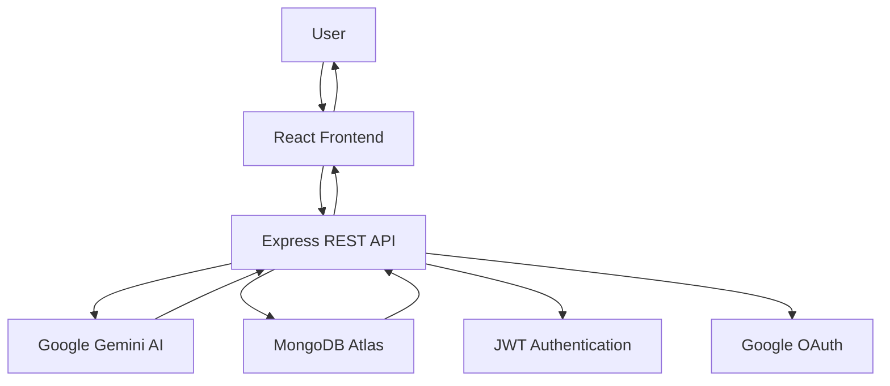
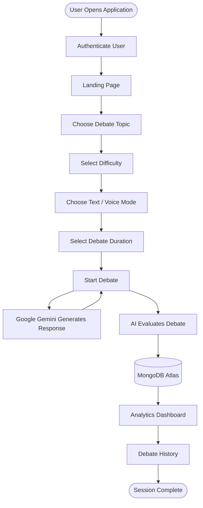

<div align="center">

# ⚔️ AI Debate Arena

### **Real-Time AI-Powered Debate & Performance Analytics Platform**

Practice structured debates against an intelligent AI opponent, receive detailed performance evaluations, and improve critical thinking, logical reasoning, and communication skills through real-time AI feedback.

<br>

[](https://react.dev/)
[](https://nodejs.org/)
[](https://expressjs.com/)
[](https://www.mongodb.com/atlas)
[](https://ai.google.dev/)
[](https://jwt.io/)
[](https://render.com/)

<br>

🚀 **Live Demo**

https://ai-debate-backend-o9rt.onrender.com/

📂 **GitHub Repository**

https://github.com/Peethambari123/AI-Debate-Arena2

</div>

---

# 📖 Table of Contents

- Overview
- Problem Statement
- Features
- Screenshots
- Tech Stack
- System Architecture
- Workflow
- Installation
- Environment Variables
- API Endpoints
- Deployment
- Future Enhancements
- Developer
- License

---

# 🌍 Overview

AI Debate Arena is a full-stack AI-powered web application that enables users to participate in structured debates against an intelligent virtual opponent.

Unlike traditional AI chatbots, the platform follows a formal debate workflow where users select a topic, choose a difficulty level, configure debate settings, present arguments, receive intelligent counterarguments, and obtain detailed AI-generated evaluations after each session.

The platform combines artificial intelligence, real-time interaction, speech technologies, and analytics to help users improve communication, critical thinking, and persuasive reasoning.

---

# ❗ Problem Statement

Developing strong debating and public speaking skills requires consistent practice, objective evaluation, and meaningful feedback.

However, traditional debate practice often depends on mentors or debate partners, making regular learning difficult. Existing AI chat applications focus on conversation rather than structured debate and rarely provide detailed performance analysis.

AI Debate Arena addresses these challenges by providing an intelligent AI debate partner capable of generating context-aware rebuttals, evaluating user performance across multiple criteria, and tracking long-term progress through comprehensive analytics.

---

# ✨ Features

## 🤖 AI Debate Engine

- AI-powered debate opponent using Google Gemini
- Intelligent context-aware counterarguments
- Real-time structured debate sessions
- Formula-based evaluation system
- Transparent AI scoring
- Multi-step debate workflow

---

## 🎯 Debate Configuration

- Multiple predefined debate topics
- Custom topic support
- Difficulty selection
  - School
  - College
  - Professional
- Voice & Text debate modes
- Configurable debate duration
- Equal speaking timer

---

## 📊 AI Evaluation

Every completed debate is evaluated across multiple parameters including:

- Topic Relevance
- Argument Structure
- Supporting Evidence
- Counter Arguments
- Logical Consistency
- Communication Quality
- Depth of Analysis

The platform generates:

- Overall Score
- AI vs User Comparison
- Performance Radar Chart
- Detailed Suggestions
- Improvement Recommendations
- Strength Analysis

---

## 📈 Analytics Dashboard

The analytics module provides visual insights including:

- Total Debates
- Win Rate
- Average Score
- Voice Debate Statistics
- Response Time Analysis
- Debate Duration
- Score Trajectory
- Win/Loss Distribution
- Performance Highlights

---

## 📜 Debate History

- View previous debates
- Search debates
- Filter by difficulty
- Filter by debate mode
- Filter by outcome
- Review previous evaluations
- Delete debate history

---

## 👤 User Management

- JWT Authentication
- Google OAuth Login
- User Registration
- Secure Login
- Profile Management
- Avatar Selection
- Password Management

---

## 🎤 Voice Features

- Speech-to-Text
- Text-to-Speech
- Voice Debate Mode
- AI Voice Responses

---

## 🎨 Modern User Interface

- Fully Responsive Design
- Dark Theme
- Interactive Dashboard
- Modern Card Layout
- Animated Components
- Clean Navigation
- Mobile-Friendly Interface

---
# 📸 Application Screenshots

## 🏠 Landing Page

<p align="center">

</p>

The landing page introduces AI Debate Arena, showcasing its AI-powered debate engine, transparent evaluation system, speech support, and quick access to the platform.

---

## ⚙️ Debate Setup

### Topic Selection

<p align="center">

</p>

Choose from predefined debate topics or create your own custom debate topic.

---

### Difficulty Selection

<p align="center">

</p>

Select the target audience difficulty level:

- School Student
- College Student
- Working Professional

The AI adjusts its arguments and evaluation accordingly.

---

### Debate Mode

<p align="center">

</p>

Choose between:

- 💬 Text Debate
- 🎤 Voice Debate

Both modes support real-time AI interaction.

---

### Debate Timer

<p align="center">

</p>

Configure equal speaking time for both the user and the AI before the debate begins.

---

## 🤖 Live AI Debate

<p align="center">

</p>

Participate in a real-time debate where the AI generates context-aware counterarguments while maintaining structured turn-based conversations.

---

## 🏆 AI Evaluation Report

<p align="center">

</p>

After every debate, the AI performs a comprehensive evaluation covering:

- Overall Winner
- Final Scores
- Time Analysis
- User Participation
- Performance Summary

---

### Detailed Performance Analysis

<p align="center">

</p>

The platform evaluates debates using seven key criteria:

- Topic Relevance
- Argument Structure
- Supporting Evidence
- Counter Arguments
- Logical Consistency
- Communication Quality
- Depth of Analysis

Each criterion includes detailed explanations and suggestions for improvement.

---

## 📊 Analytics Dashboard

<p align="center">

</p>

Track your overall debate performance through an interactive dashboard featuring:

- Total Debates
- Win Rate
- Average Score
- Voice Debate Statistics
- Response Time
- Debate Duration

---

### Performance Visualizations

<p align="center">

</p>

Interactive visualizations include:

- Debate Score Trajectory
- Win/Loss Distribution
- Performance Highlights
- MongoDB Analytics

---

## 📜 Debate History

<p align="center">

</p>

Browse previously completed debates with advanced filtering options based on:

- Topic
- Outcome
- Difficulty
- Debate Mode
- Date

---

## 👤 User Profile

<p align="center">

</p>

Manage account information including:

- Personal Details
- Username
- Profile Picture
- Password
- Authentication Settings

---

# 🛠 Technology Stack

## Frontend

| Technology | Purpose |
|------------|---------|
| React.js | User Interface |
| Tailwind CSS | Responsive Styling |
| Framer Motion | UI Animations |
| React Router | Navigation |
| Lucide React | Icons |
| Recharts | Analytics Charts |
| Web Speech API | Speech Recognition |
| SpeechSynthesis API | AI Voice Responses |

---

## Backend

| Technology | Purpose |
|------------|---------|
| Node.js | Runtime Environment |
| Express.js | REST API Development |
| MongoDB Atlas | Cloud Database |
| Mongoose | Object Data Modeling |
| JWT | User Authentication |
| Passport.js | Google OAuth Authentication |
| bcrypt | Password Encryption |
| dotenv | Environment Configuration |

---

## Artificial Intelligence

| Technology | Purpose |
|------------|---------|
| Google Gemini AI | AI Debate Generation |
| Prompt Engineering | Context-Aware Responses |
| AI Evaluation Engine | Performance Assessment |
| Formula-Based Scoring | Transparent Evaluation |

---

## Deployment

| Technology | Purpose |
|------------|---------|
| Render | Application Hosting |
| MongoDB Atlas | Managed Cloud Database |
| GitHub | Version Control |
# 🏗️ System Architecture



The application follows a modern client-server architecture where the React frontend communicates with an Express.js backend. The backend handles authentication, AI interactions through Google Gemini, and persistent storage using MongoDB Atlas.

---

# 🔄 Application Workflow



---

# 📂 Project Structure

```text
AI-Debate-Arena2/

├── public/
│
├── src/
│   ├── assets/
│   ├── components/
│   ├── pages/
│   ├── hooks/
│   ├── utils/
│   ├── services/
│   ├── App.js
│   └── index.js
│
├── server/
│
├── package.json
├── package-lock.json
├── .env.example
├── README.md
└── .gitignore
```

---

# ⚙️ Installation

## Clone the Repository

```bash
git clone https://github.com/Peethambari123/AI-Debate-Arena2.git

cd AI-Debate-Arena2
```

---

## Install Dependencies

```bash
npm install
```

---

## Configure Environment Variables

Create a `.env` file in the project root.

```bash
cp .env.example .env
```

Update the environment variables before running the application.

---

## Start Development Server

```bash
npm start
```

The application will be available at:

```
http://localhost:3000
```

---

# 🔐 Environment Variables

Create a `.env` file and configure the following variables.

```env
PORT=

MONGO_URI=

JWT_SECRET=

SESSION_SECRET=

GOOGLE_CLIENT_ID=

GOOGLE_CLIENT_SECRET=

GEMINI_API_KEY=

CLIENT_URL=

REACT_APP_API_URL=
```

> Never commit your `.env` file or API keys to GitHub.

---

# 📡 REST API Endpoints

## Authentication

| Method | Endpoint | Description |
|---------|----------|-------------|
| POST | `/auth/register` | Register a new user |
| POST | `/auth/login` | User login |
| GET | `/auth/google` | Google OAuth Login |
| GET | `/auth/me` | Fetch authenticated user |
| PUT | `/auth/profile` | Update profile |
| PUT | `/auth/password` | Change password |

---

## Debate

| Method | Endpoint | Description |
|---------|----------|-------------|
| POST | `/api/gemini` | Generate AI response |
| POST | `/debates/save` | Save completed debate |
| GET | `/debates/history` | Retrieve debate history |
| GET | `/debates/analytics` | Fetch analytics data |
| DELETE | `/debates/:id` | Delete a debate |

---

# 🚀 Deployment

The application is deployed using **Render** with **MongoDB Atlas** as the cloud database.

### Deployment Steps

1. Push the project to GitHub.
2. Create a new Web Service on Render.
3. Connect the GitHub repository.
4. Configure all required environment variables.
5. Deploy the application.

---

## 🌐 Live Demo

**Application**

https://ai-debate-backend-o9rt.onrender.com/

**Repository**

https://github.com/Peethambari123/AI-Debate-Arena2

# 🔮 Future Enhancements

AI Debate Arena is designed with scalability in mind. Planned enhancements include:

- 🌍 Multi-language Debate Support
- 👥 Multiplayer Human vs Human Debate Mode
- 🤝 Team Debate Sessions
- 🏆 Leaderboards & Rankings
- 📄 PDF Performance Reports
- 📱 Mobile Application
- 🎯 Personalized AI Debate Coach
- 📚 Topic Recommendation System
- 📈 Advanced Performance Analytics
- 🎙️ Enhanced Voice Recognition & Speech Analysis
- 🌐 Community Debate Platform
- 🔔 Email Notifications & Progress Reports

---

# 👨‍💻 Developer

<div align="center">

## **Peethambari Manavarti**

**B.Tech – Computer Science & Engineering (AI & Data Science)**

Passionate about Artificial Intelligence, Full-Stack Development, and building intelligent software solutions.

### 🔗 Links

**GitHub**

https://github.com/Peethambari123

**Project Repository**

https://github.com/Peethambari123/AI-Debate-Arena2

**Live Demo**

https://ai-debate-backend-o9rt.onrender.com/

</div>

---

# 📄 License

This project is licensed under the **MIT License**.

You are free to use, modify, and distribute this software in accordance with the terms of the MIT License.

See the `LICENSE` file for more information.
