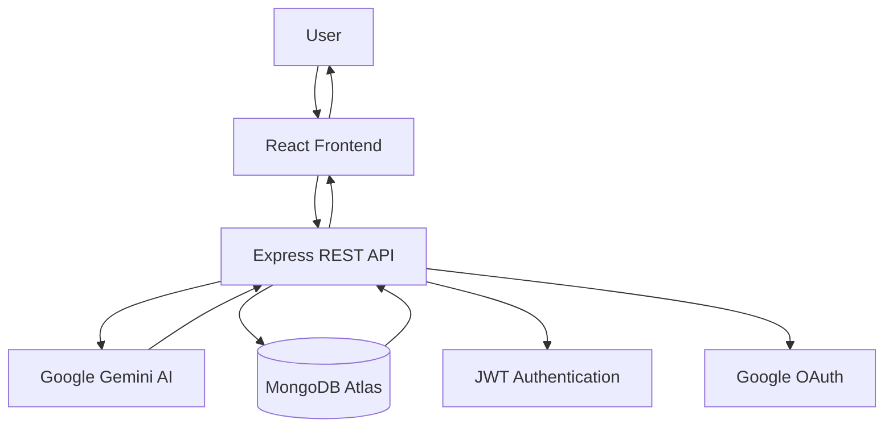
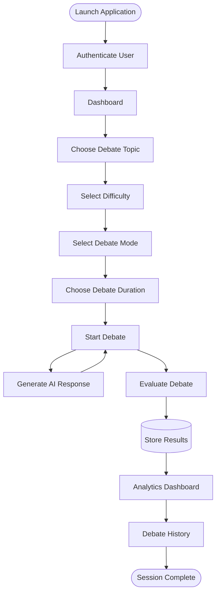

<div align="center">

# ⚔️ AI Debate Arena

### Real-Time AI-Powered Debate & Performance Analytics Platform

Practice structured debates against an intelligent AI opponent, receive comprehensive AI-powered evaluations, and improve your communication, critical thinking, and logical reasoning skills through an interactive learning experience.

<br>

[](https://react.dev/)
[](https://nodejs.org/)
[](https://www.mongodb.com/atlas)
[](https://ai.google.dev/)

</div>

---

# 📖 Table of Contents

- Overview
- Problem Statement
- Key Features
- Technology Stack
- System Architecture
- Application Workflow
- Project Structure
- Installation
- Environment Variables
- REST API
- Deployment
- Security
- Future Enhancements
- License
- Developer

---

# 🌍 Overview

AI Debate Arena is a full-stack AI-powered web application that enables users to participate in structured debates with an intelligent virtual opponent.

Unlike traditional conversational AI systems, AI Debate Arena follows a complete debate workflow where users choose a topic, configure debate settings, engage in a real-time debate, receive intelligent counterarguments, and obtain transparent AI-generated performance evaluations.

The platform combines Artificial Intelligence, Natural Language Processing, Speech Technologies, Analytics, and Modern Web Development to provide an engaging environment for improving debating and communication skills.

---
# 🚀 Project Highlights

- 🤖 AI-powered structured debate platform
- 🎙 Supports both Voice and Text debate modes
- 📊 Transparent AI evaluation with performance analytics
- 📈 Interactive dashboard for long-term progress tracking
- 🔐 Secure authentication using JWT and Google OAuth
- ⚡ Modern React + Express + MongoDB architecture

# ❗ Problem Statement

Developing strong debating and public speaking skills requires regular practice, objective evaluation, and constructive feedback.

Traditional debate practice usually depends on mentors or debate partners, making consistent improvement difficult.

Most AI chat applications generate responses but do not evaluate:

- Argument quality
- Logical consistency
- Supporting evidence
- Communication effectiveness
- Overall debating performance

AI Debate Arena addresses these challenges by providing an intelligent AI debate partner capable of generating context-aware rebuttals while simultaneously evaluating user performance using multiple assessment criteria.

---

# ✨ Key Features

## 🤖 AI Debate Engine

- AI-powered debate opponent using Google Gemini
- Context-aware rebuttal generation
- Structured turn-based debate workflow
- Real-time AI responses
- Transparent scoring methodology
- Multi-step debate evaluation

---

## 🎯 Debate Configuration

- Predefined debate topics
- Custom debate topics
- Difficulty selection
  - School
  - College
  - Professional
- Text Debate Mode
- Voice Debate Mode
- Configurable debate duration
- Equal speaking timer

---

## 📊 AI Evaluation

Every completed debate is evaluated across multiple dimensions.

Evaluation criteria include:

- Topic Relevance
- Argument Structure
- Supporting Evidence
- Counter Arguments
- Logical Consistency
- Communication Quality
- Depth of Analysis

Each report provides:

- Overall Score
- AI vs User Comparison
- Performance Summary
- Strength Analysis
- Improvement Suggestions
- Personalized Feedback

---

## 📈 Analytics Dashboard

Track long-term improvement using interactive analytics.

Available metrics include:

- Total Debates
- Win Rate
- Average Score
- Debate Duration
- Response Time
- Performance Trends
- Historical Progress

---

## 📜 Debate History

Review previous debate sessions with:

- Search
- Filtering
- Sorting
- Performance Reports
- Previous Evaluations
- Complete Debate History

---

## 👤 User Management

- Secure User Registration
- JWT Authentication
- Google OAuth Login
- Profile Management
- Avatar Support
- Password Management

---

## 🎤 Voice Features

- Speech-to-Text
- Text-to-Speech
- Voice Debate Mode
- AI Voice Responses

---

## 🎨 User Experience

- Responsive Design
- Modern Interface
- Dark Theme
- Interactive Dashboard
- Animated Components
- Mobile-Friendly Layout
- ---

# 🛠 Technology Stack

## Frontend

| Technology | Purpose |
|------------|---------|
| React.js | Build the user interface |
| Tailwind CSS | Responsive styling |
| React Router | Client-side routing |
| Framer Motion | Smooth animations |
| Recharts | Analytics visualization |
| Lucide React | Icons |
| Web Speech API | Speech Recognition |
| SpeechSynthesis API | AI Voice Output |

---

## Backend

| Technology | Purpose |
|------------|---------|
| Node.js | Runtime Environment |
| Express.js | REST API |
| MongoDB Atlas | Cloud Database |
| Mongoose | Database Modeling |
| JWT | User Authentication |
| Passport.js | Google OAuth Authentication |
| bcrypt | Password Encryption |
| dotenv | Environment Configuration |

---

## Artificial Intelligence

| Technology | Purpose |
|------------|---------|
| Google Gemini AI | Debate Response Generation |
| Prompt Engineering | Context-Aware AI Responses |
| Evaluation Engine | Debate Performance Analysis |
| Formula-Based Scoring | Transparent Scoring System |

---

## Development Tools

| Tool | Purpose |
|------|---------|
| Git | Version Control |
| GitHub | Source Code Management |
| Postman | API Testing |
| VS Code | Development Environment |

---

# 🏗️ System Architecture



---

# 🔄 Application Workflow



---

# 📂 Project Structure

```text
AI-Debate-Arena/

├── public/
│
├── src/
│   ├── assets/
│   ├── components/
│   ├── hooks/
│   ├── pages/
│   ├── services/
│   ├── utils/
│   ├── App.js
│   └── index.js
│
├── server/
│
├── package.json
├── package-lock.json
├── README.md
├── .env.example
└── .gitignore
```

---

# ⚙️ Installation

## Clone the Repository

```bash
git clone <repository-url>

cd AI-Debate-Arena
```

---

## Install Dependencies

```bash
npm install
```

---

## Configure Environment Variables

Create a `.env` file in the project root.

```bash
cp .env.example .env
```

Update the required environment variables before starting the application.

---

## Start Development Server

```bash
npm start
```

The application will run locally on:

```text
http://localhost:3000
```

---

# 🔐 Environment Variables

Create a `.env` file and configure the following values.

```env
PORT=

MONGO_URI=

JWT_SECRET=

SESSION_SECRET=

GOOGLE_CLIENT_ID=

GOOGLE_CLIENT_SECRET=

GEMINI_API_KEY=

CLIENT_URL=

REACT_APP_API_URL=
```

> **Important:** Never commit your `.env` file or API keys to version control.
> ---

# 📡 REST API

## Authentication

| Method | Endpoint | Description |
|---------|----------|-------------|
| POST | `/auth/register` | Register a new user |
| POST | `/auth/login` | Login user |
| GET | `/auth/google` | Google OAuth Authentication |
| GET | `/auth/me` | Get authenticated user |
| PUT | `/auth/profile` | Update user profile |
| PUT | `/auth/password` | Update password |

---

## Debate

| Method | Endpoint | Description |
|---------|----------|-------------|
| POST | `/api/gemini` | Generate AI debate response |
| POST | `/debates/save` | Save debate |
| GET | `/debates/history` | Get debate history |
| GET | `/debates/analytics` | Retrieve analytics |
| DELETE | `/debates/:id` | Delete a debate |

---

# 🚀 Deployment

The application can be deployed on any cloud platform that supports Node.js applications.

## Requirements

- Node.js 18+
- MongoDB Atlas Database
- Google Gemini API Key
- Google OAuth Credentials

---

## Build

```bash
npm install

npm run build
```

---

## Run

```bash
npm start
```

---

## Production Environment

Configure all required environment variables before deployment.

```
PORT
MONGO_URI
JWT_SECRET
SESSION_SECRET
GOOGLE_CLIENT_ID
GOOGLE_CLIENT_SECRET
GEMINI_API_KEY
CLIENT_URL
REACT_APP_API_URL
```

---

# 🔒 Security

AI Debate Arena follows modern web security practices.

### Authentication

- JWT Authentication
- Google OAuth
- Protected Routes

### Password Security

- bcrypt Password Hashing
- Secure Session Management

### API Security

- Input Validation
- Environment Variable Protection
- Secure Database Access

---

# ⚡ Performance

The application is optimized for responsive user experience.

- Efficient React Rendering
- Reusable Components
- Optimized MongoDB Queries
- RESTful API Architecture
- Responsive Design
- Lazy Loading Support
- Modular Code Structure

---

# 💡 Future Enhancements

Planned improvements include:

- 🌍 Multi-language Debate Support
- 👥 Human vs Human Debate Mode
- 🤝 Team Debate Sessions
- 🏆 Global Leaderboards
- 📄 Downloadable PDF Reports
- 📱 Mobile Application
- 🎯 Personalized AI Debate Coach
- 📚 AI Topic Recommendation
- 📊 Advanced Analytics
- 🎙 Improved Voice Recognition
- ☁ Cloud Storage Integration
- 🤖 Multiple AI Model Support

---

# 🤝 Contributing

Contributions are welcome.

1. Fork the repository.
2. Create a new feature branch.

```bash
git checkout -b feature-name
```

3. Commit your changes.

```bash
git commit -m "Add new feature"
```

4. Push the branch.

```bash
git push origin feature-name
```

5. Open a Pull Request.

Please follow the existing coding style and project structure.

---

# ❓ Frequently Asked Questions

### What is AI Debate Arena?

AI Debate Arena is a full-stack web application that enables users to practice structured debates against an AI-powered opponent while receiving detailed performance evaluations.

---

### Which AI model is used?

Google Gemini AI powers debate generation and performance evaluation.

---

### Does the platform support voice debates?

Yes. Users can participate using either voice or text mode.

---

### Is user authentication secure?

Yes. The platform uses JWT authentication, Google OAuth, and encrypted password storage.

---

### Can users view previous debates?

Yes. Every completed debate is stored along with analytics and evaluation reports.

---

# 📜 License

This project is licensed under the **MIT License**.

You are free to use, modify, and distribute this project in accordance with the terms of the MIT License.

---

# 👨‍💻 Developer

**Peethambari Manavarti**

**B.Tech – Computer Science & Engineering (AI & Data Science)**

Passionate about Artificial Intelligence, Full-Stack Development, Machine Learning, and building intelligent software solutions.

---

# 🙏 Acknowledgements

Special thanks to the open-source community and the creators of the technologies that made this project possible:

- React
- Node.js
- Express.js
- MongoDB Atlas
- Google Gemini AI
- Tailwind CSS
- Framer Motion

---

<div align="center">

## ⚔️ AI Debate Arena

### Practice • Debate • Learn • Improve

Built with **React**, **Node.js**, **Express.js**, **MongoDB Atlas**, and **Google Gemini AI**.

⭐ Thank you for exploring AI Debate Arena!

</div>
