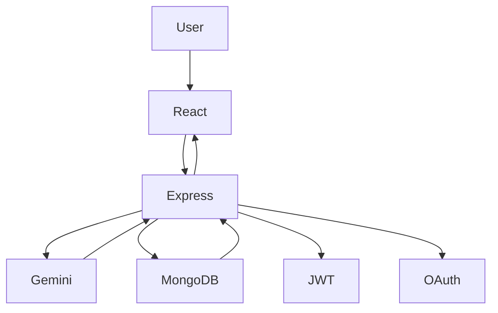
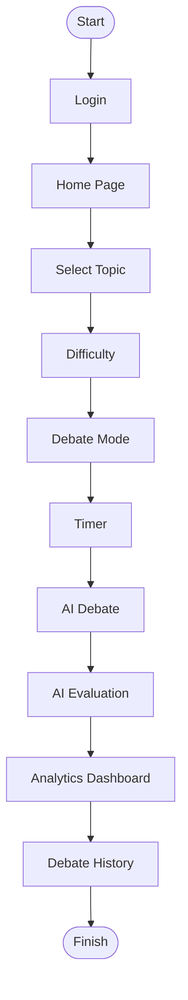

<div align="center">

# ⚔️ AI Debate Arena

### Real-Time AI-Powered Debate & Performance Analytics Platform

Practice structured debates against an intelligent AI opponent, receive comprehensive performance evaluations, and strengthen your communication, critical thinking, and logical reasoning skills through real-time AI-powered feedback.

<br>

[](https://react.dev/)
[](https://nodejs.org/)
[](https://www.mongodb.com/atlas)
[](https://ai.google.dev/)

</div>

---

# 📖 Table of Contents

- Overview
- Problem Statement
- Features
- Technology Stack
- System Architecture
- Application Workflow
- Project Structure
- Installation
- Environment Variables

---

# 🌍 Overview

AI Debate Arena is a full-stack AI-powered web application that enables users to practice structured debates with an intelligent virtual opponent.

Unlike traditional AI chat applications, AI Debate Arena follows a formal debate workflow where users:

- Choose a debate topic
- Select a difficulty level
- Configure debate settings
- Participate in real-time debates
- Receive AI-generated rebuttals
- Obtain transparent performance evaluations
- Track long-term improvement through analytics

The platform combines Artificial Intelligence, Natural Language Processing, Speech Technologies, Data Analytics, and Modern Web Technologies to create an engaging learning experience.

---

# ❗ Problem Statement

Developing strong debating and public speaking skills requires continuous practice, objective evaluation, and constructive feedback.

Traditional debate practice often depends on mentors, teachers, or debate partners, making regular learning difficult.

Most conversational AI systems generate responses but do not evaluate:

- Argument quality
- Logical consistency
- Evidence usage
- Communication effectiveness
- Overall debating performance

AI Debate Arena addresses these challenges by providing an intelligent AI debate partner capable of generating context-aware counterarguments while simultaneously evaluating user performance across multiple dimensions.

---

# ✨ Features

## 🤖 AI Debate Engine

- AI-powered debate opponent using Google Gemini
- Context-aware rebuttal generation
- Structured turn-based debate workflow
- Real-time response generation
- Formula-based evaluation system
- Transparent AI scoring

---

## 🎯 Debate Configuration

- Multiple predefined debate topics
- Custom topic support
- Difficulty selection

  - School
  - College
  - Professional

- Voice Debate Mode
- Text Debate Mode
- Configurable debate duration
- Equal speaking timer

---

## 📊 AI Evaluation

Each completed debate is evaluated across several parameters including:

- Topic Relevance
- Argument Structure
- Supporting Evidence
- Counter Arguments
- Logical Consistency
- Communication Quality
- Depth of Analysis

The evaluation includes:

- Overall Score
- Winner Prediction
- AI vs User Comparison
- Strength Analysis
- Weakness Analysis
- Personalized Suggestions
- Improvement Recommendations

---

## 📈 Analytics Dashboard

Track debate performance through interactive analytics.

Features include:

- Total Debates
- Win Rate
- Average Score
- Debate Duration
- Voice Debate Statistics
- Response Time Analysis
- Performance Trends
- Historical Progress

---

## 📜 Debate History

Users can review previous debates with:

- Search
- Filters
- Sorting
- Previous Evaluations
- Performance History
- Debate Replay

---

## 👤 User Management

- JWT Authentication
- Google OAuth Login
- Secure Registration
- Login System
- Profile Management
- Avatar Selection
- Password Management

---

## 🎤 Voice Features

- Speech-to-Text
- Text-to-Speech
- Voice Debate Mode
- AI Voice Responses

---

## 🎨 User Experience

- Responsive Design
- Modern UI
- Dark Theme
- Interactive Dashboard
- Animated Components
- Mobile Friendly

---

# 🛠 Technology Stack

## Frontend

| Technology | Purpose |
|------------|---------|
| React.js | User Interface |
| Tailwind CSS | Styling |
| Framer Motion | Animations |
| React Router | Routing |
| Recharts | Analytics |
| Lucide React | Icons |
| Web Speech API | Speech Recognition |
| SpeechSynthesis API | Voice Responses |

---

## Backend

| Technology | Purpose |
|------------|---------|
| Node.js | Runtime |
| Express.js | REST API |
| MongoDB Atlas | Database |
| Mongoose | ODM |
| JWT | Authentication |
| Passport.js | Google OAuth |
| bcrypt | Password Encryption |
| dotenv | Environment Variables |

---

## Artificial Intelligence

| Technology | Purpose |
|------------|---------|
| Google Gemini | Debate Generation |
| Prompt Engineering | AI Context |
| Evaluation Engine | Performance Analysis |
| Formula-Based Scoring | Transparent Assessment |

---

## Deployment

| Technology | Purpose |
|------------|---------|
| Render | Hosting |
| MongoDB Atlas | Cloud Database |
| GitHub | Version Control |

---

# 🏗️ System Architecture



---

# 🔄 Application Workflow



---

# 📂 Project Structure

```text
AI-Debate-Arena2

├── public
├── src
│   ├── assets
│   ├── components
│   ├── hooks
│   ├── pages
│   ├── services
│   ├── utils
│   ├── App.js
│   └── index.js
│
├── server
├── package.json
├── README.md
└── .gitignore
```

---

# ⚙️ Installation

## Clone Repository

```bash
git clone <repository-url>

cd AI-Debate-Arena2
```

---

## Install Dependencies

```bash
npm install
```

---

## Configure Environment Variables

```bash
cp .env.example .env
```

Update the required API keys and configuration values.

---

## Run Development Server

```bash
npm start
```

Application will be available at:

```
http://localhost:3000
```

---

# 🔐 Environment Variables

```env
PORT=

MONGO_URI=

JWT_SECRET=

SESSION_SECRET=

GOOGLE_CLIENT_ID=

GOOGLE_CLIENT_SECRET=

GEMINI_API_KEY=

CLIENT_URL=

REACT_APP_API_URL=
```

> Never commit your `.env` file or API keys to version control.
# 📡 REST API Endpoints

## Authentication

| Method | Endpoint | Description |
|---------|----------|-------------|
| POST | `/auth/register` | Register a new user |
| POST | `/auth/login` | Authenticate user |
| GET | `/auth/google` | Google OAuth Login |
| GET | `/auth/me` | Fetch authenticated user |
| PUT | `/auth/profile` | Update user profile |
| PUT | `/auth/password` | Change password |

---

## Debate

| Method | Endpoint | Description |
|---------|----------|-------------|
| POST | `/api/gemini` | Generate AI debate response |
| POST | `/debates/save` | Save completed debate |
| GET | `/debates/history` | Retrieve debate history |
| GET | `/debates/analytics` | Fetch analytics |
| DELETE | `/debates/:id` | Delete a debate |

---

# 🚀 Deployment

The application is designed for cloud deployment using **Render** for hosting and **MongoDB Atlas** as the managed database service.

## Prerequisites

- Node.js (v18 or later)
- MongoDB Atlas Account
- Google Gemini API Key
- Google OAuth Credentials

---

## Deployment Steps

### 1. Clone the Repository

```bash
git clone <repository-url>
cd AI-Debate-Arena2
```

### 2. Install Dependencies

```bash
npm install
```

### 3. Configure Environment Variables

Create a `.env` file and configure all required environment variables.

### 4. Build the Application

```bash
npm run build
```

### 5. Deploy

Deploy the application using your preferred hosting platform (e.g., Render, Railway, or Vercel for the frontend).

---

# 🔒 Security Features

AI Debate Arena incorporates several security best practices.

- JWT-based Authentication
- Google OAuth Integration
- Password Hashing using bcrypt
- Protected API Routes
- Secure Environment Variables
- Session Management
- Input Validation
- Database Protection

---

# ⚡ Performance Optimizations

The application includes various optimizations to improve performance.

- Efficient React Component Rendering
- Optimized MongoDB Queries
- Lazy Loading
- Reusable Components
- RESTful API Architecture
- Responsive UI
- Lightweight Design

---

# 💡 Future Enhancements

The platform is designed with scalability in mind.

Future improvements include:

- 🌍 Multi-language Debate Support
- 👥 Human vs Human Debate Mode
- 🤝 Team Debate Sessions
- 🏆 Global Leaderboards
- 📄 Downloadable PDF Reports
- 📱 Android & iOS Applications
- 🎯 Personalized AI Debate Coach
- 📚 AI Topic Recommendations
- 📊 Advanced Analytics Dashboard
- 🎙 Improved Speech Recognition
- 🌐 Community Debate Platform
- 📧 Email Progress Reports
- ☁ Cloud Storage Integration
- 🤖 Multiple AI Model Support

---

# 🤝 Contributing

Contributions are welcome!

If you would like to improve AI Debate Arena:

1. Fork the repository.
2. Create a feature branch.

```bash
git checkout -b feature/new-feature
```

3. Commit your changes.

```bash
git commit -m "Add new feature"
```

4. Push the branch.

```bash
git push origin feature/new-feature
```

5. Open a Pull Request.

Please ensure your code follows the existing project structure and coding standards.

---

# 🧪 Testing

Run the project locally before submitting changes.

```bash
npm install

npm start
```

Verify that:

- Authentication works correctly
- Debate generation functions as expected
- Analytics update properly
- History is saved successfully
- Voice mode works (if supported)

---

# ❓ Frequently Asked Questions

### Which AI model powers the debates?

Google Gemini is used to generate debate responses and evaluate user performance.

---

### Does the application support voice debates?

Yes. Users can choose between text-based and voice-based debate modes.

---

### Is authentication secure?

Yes. The application uses JWT authentication along with Google OAuth integration and encrypted password storage.

---

### Can users review previous debates?

Yes. Every completed debate is stored in the debate history along with performance analytics.

---

### Is the project responsive?

Yes. The interface is designed to work across desktop, tablet, and mobile devices.

---

# 📜 License

This project is licensed under the **MIT License**.

You are free to use, modify, and distribute this software under the terms of the MIT License.

See the `LICENSE` file for more details.

---

# 👨‍💻 Developer

**Peethambari Manavarti**

B.Tech – Computer Science & Engineering (AI & Data Science)

Passionate about Artificial Intelligence, Full-Stack Development, Machine Learning, and building impactful AI-driven applications.

---

## ⭐ Support

If you found this project useful:

- ⭐ Star the repository
- 🍴 Fork the project
- 💬 Share your feedback
- 🚀 Contribute new features

Your support helps improve the project and motivates further development.

---

<div align="center">

### ⚔️ AI Debate Arena

**Practice • Debate • Learn • Improve**

Built with ❤️ using React, Node.js, MongoDB Atlas, and Google Gemini AI.

</div>
